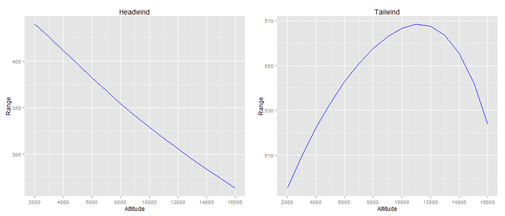

## Getting the Data
- The data for this analysis were taken from the [X-Plane](http://www.x-plane.com/desktop/home/) desktop computer flight simulator.
- The aircraft performance characteristics are provided to X-Plane via installable software developed by [Carenado](http://www.carenado.com/CarSite/Portal/index.php).
- The data were gathered by manually "flying" the simulator at various airspeeds, altitudes, weather conditions, fuel quantities, and payloads. At various points, data was manually recorded.
- The recorded data were entered into Microsoft Excel for exploratory data analysis.
- The data were then placed in .csv files for use in the R software environment for statistical computing and graphics.

---

## The Calculations

- Since this application was developed to provide insight into gaining maximum fuel efficiency, it assumes the pilot will fly at the maximum range airspeed.
  + Fully understanding airspeed's impact would require a slightly different analysis focused on airspeed rather than altitude.
- The algorithms to convert between calibrated and true airspeed can be quite complex to derive. I gratefully use the equations provided by Ed Williams, from his [website](http://williams.best.vwh.net/avform.htm).
- The simulated aircraft was flown with the fuel mixture set for "Lean of Peak" operations, providing significant increases in fuel efficiency. While beyond the scope of this discussion, engine modifications have made this practice less controversial than it has been in the past.
- The application computes a maximum altitude for any given fuel weight. This altitude equates to the aircraft's service ceiling--the altitude at which the aircraft can climb at only 200 feet per minute.
- Over long distances, range can be extended slightly by slowing the aircraft a few knots (nautical miles per hour) as fuel is burned and weight decreases. This analysis makes simplifying assumptions and does not compute this effect.

---

## Displaying the Results
- The following charts show the dramatic effect of wind:

 

---

